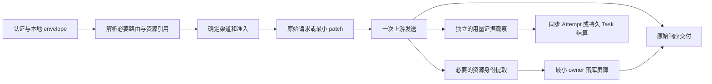

# OpenAI 协议透明透传扩展实现方案

## 文档状态

- 状态：实施记录与目标契约（2026-09-20）。A0/A1/A2/A3、W、B1/B2、C，以及 D 中 Stored Chat、历史音频与首批 Batch 已在本工作树落实；最终验证范围见第 10 节。D/N 的条件专项不因本轮实施自动成为上线承诺。
- 适用范围：OpenAI 原生渠道、使用 OpenAI 方言的渠道及 Custom 渠道；另纳入已发现的 Gemini action 错派修复，其他 Claude/Gemini 原生能力列为 N 扩展专项。跨协议 adapter 只复用明确可表示的部分。
- 设计取向：客户端组织调用并处理回执，上游判断业务状态和参数是否合法；代理原样交付，仅维护自身认证、资源授权、选路、容量与计费的最小事实，不实现上游业务状态校验器。
- 当前事实基线：[协议覆盖调研](../research/openai-api-protocol-coverage-2026-09-19.md)。调研说明“缺什么”，本文决定“补什么、如何补、何时可以开放”。
- 现有约束：[Responses 透明转发](./responses-transparent-relay-design.md)、[Usage TCC](./usage-confirmed-tcc-billing-architecture.md)、[异步任务](./task-coordination-architecture.md)、[自定义接口配置](./channel-endpoints.md)。本文记录扩展支持面与实施边界；明确后置的专项仍不覆盖现行准入。

### 本轮实施状态

| 范围 | 当前结果与验证 |
| --- | --- |
| A0/A1/A2/A3 | 引用语义、Gemini action、声音边界、JSON edits、音频/图片/兼容 SSE、Custom raw 已通过定向回归 |
| B1/B2 | 资源 SQL owner、管理员 token 选路、Files/Uploads/Conversations、初始/最终引用授权与流式大文件已通过定向回归 |
| C | 单 Task 的后台创建/轮询/取消/恢复、透明删除及墓碑访问已通过集成与对应 race 测试 |
| W | 原始并行命令与多 work 观察、steering/显式 create 歧义收尾、容量释放与迟到防误配已通过定向与 Parallel race |
| D 中本轮开放部分 | Stored Chat、历史音频 owner 已通过定向联动；首批 Batch 的三包定向及 race 已通过，范围与保留限制见第 7.3 节 |
| 条件后置与不建设 | Realtime OOB/sideband/实时直连、声音管理、托管资源收费等仍按第 1 节条件；官方 Videos 不默认建设，N 未实施原生操作继续记录缺口 |

这些结果是本地代码/fixture 验证，不是已发布或真实上游联调；全包结果和部署数据库边界见第 10 节。

## 0. 协议覆盖口径与复核结论

“发现所有未实现协议”和“实现所有官方接口”是两个目标。协议账本应覆盖 method/path、同路径 action、JSON/multipart/SSE/WS/二进制、普通用户与管理员、创建/引用/派生/读取/删除、异步完成、计费 evidence 和上游退役状态；不以路由注册或 DTO 字段数代表支持完成。

重点包括 Responses WS `stream_id` 并行 lane 与 steering 后继关联、`tool_search_output` 内函数 schema 误拒绝、Realtime `call_id` sideband attach、Speech/Chat/Realtime 声音消费与历史音频句柄边界、Secure MCP Tunnel、Webhook 接收交付，以及项目原生 Claude/Gemini 的范围缺口。原 OpenAI 调研的范围是合理的，但不足以宣称已覆盖整项目；其他原生协议需要独立账本与验收，不合并为 OpenAI provider 特判。

覆盖账本分别记录实现状态、授权范围、上游生命周期、验证程度与产品取舍；[版本化账本](../research/protocol-inventory-2026-09-19.json) 的 62 条是审查条目，不是 62 个新增 bug，也不是对所有 provider/参数的穷尽证明。未验证的上游生命周期保留 unknown。账本属于文档/测试资产，不成为动态运行时路由或能力配置来源。

### 0.1 子操作与模式的核对范围

家族摘要保留稳定 ID，新增能力按不同实现状态分列；当前账本有 62 项、12 个子操作，并以薄的子操作索引记录已核查模式，不是比较全集。补项包括 Realtime session.update/response.create 两处声音引用、Chat voice 联合类型、Chat 历史音频句柄、Realtime 并行 out-of-band、声音管理的 consent_phrases 子操作，以及 C05 音频 SSE 终态依赖交付限制。

每个实施批次先冻结适用的供应商、方言版本和公开支持范围，再建立薄索引：method/path 或 WS action、改变授权/状态/计费的模式、输入引用及派生产出位置、传输、权限范围、当前实现/限制/不在范围/未核验、来源日期和测试。官方比较范围同时取 Reference/OpenAPI、指南和变更/弃用页；本地同时查路由、动态 action、handler、adapter 和 gate。只覆盖项目承接的方言，不扩成厂商全部平台 API，也不生成运行时路由。

普通用户顶层 list、Batch 模型重写、本地容量预算等真实能力限制须分项保留；Realtime 单 inflight 与当前新增 Responses 恢复流的支持分别记录。撤销上一版的活跃后台 DELETE、任务依赖文件删除及 W 业务组合门禁，不再把它们列为目标操作规则。家族上线时逐项更新，不能一次把全部子项标为支持。完整盘点不阻塞已经明确边界的独立修复批次。

## 1. 功能取舍

透明透传的收益是降低上游协议演进带来的维护成本。是否实施一个 API，应看它能否复用现有交付路径，以及代理是否有办法守住自己的边界；不以 DTO 有没有列出字段作为依据。

| 能力 | 结论 | 实施方式与开放条件 |
| --- | --- | --- |
| 当前协议边界误拒绝/错派 | **先修复** | A0 修复资源提取、Gemini action 分发，覆盖 Speech/Chat/Realtime 声音消费及历史音频引用；Chat voice 联合类型与引用门控同批修复 |
| Responses WS stream_id 并行 lane | **应单独实现** | W 阶段复用现有连接与 Attempt 原语，增加连接内有界 lane/work 归属；不能只删除 gate |
| JSON images edits、未知字段/联合类型、兼容 SSE 保真 | **应优先实现** | 修正现有路径；原始 body/frame 加最小 model patch，不重建业务对象 |
| Images generations/edits SSE | **应优先实现** | 共用原始 SSE 交付，图片 adapter 独立观察最终 usage；已具备 stream 交付的 adapter 才开放 |
| Custom 管理员指定渠道资源透传 | **应实现** | 与 OpenAI 复用已登记资源路径、endpoint 解析和原始响应策略；保留管理员授权 |
| 普通用户 Files/Uploads 与文件引用 | **应实现** | 增加最小资源 owner 和无 model 请求的确定性选路；先交付 create/get/delete/content、upload parts/complete/cancel |
| Conversations 与 Responses conversation | **应实现** | 复用资源 owner，支持会话及 items 操作；多轮状态留在上游 |
| Responses background/cancel/流恢复 | **应实现** | 接入持久 Task 结算；原样转发状态、事件和恢复游标；不让 HTTP 连接拥有后台任务 |
| Stored Chat | **可以实现，排在上述能力之后** | 复用资源 owner；create/get/update/delete/messages；账号级 list 遵循第 5 节限制 |
| Vector Stores/File Search、Containers/Code Interpreter/hosted shell、Skills | **有条件实现** | 资源生命周期、派生资源授权和各自独立收费单位都闭合后逐家族开放 |
| Videos/Sora | **官方上游停止默认新建** | 官方 Videos API 将于 2026-09-24 关闭；仅对有明确持续服务承诺和实际需求的兼容厂商另行立项，缺口仍保留在账本 |
| Batch | **可以实现，但独立成阶段** | 文件归属、逐条准入、结果 usage 聚合与部分取消结算，不按单次 Chat 请求处理 |
| Realtime 并行 out-of-band | **独立补齐观察能力，可后置** | 当前单 s.turn 限制记为缺口；建立有界多响应证据索引，不自行判断默认会话忙闲，不归入 W |
| Realtime Translation / GPT-Live 的 WS | **可以实现，按产品需求排序** | 复用 wsconn；分别实现事件归属、work 准入与最终 usage，不套用现有 Realtime 事件状态机 |
| Realtime WebRTC/SIP/client_secrets | **暂不作为普通用户透明接口开放** | 先解决直连后本地准入、可信 usage、撤销与失联处置；sideband 存在不等于控制闭合 |
| Audio text/srt/vtt、Chat Search | **可透传，但有收费前提** | 无可信用量只能 Cancel、最终不收费；本方案默认保留付费路径门控，不用本地估算冒充用量 |
| OpenAI 区域处理域名 | **条件成熟再开放** | 是部署与定价支持，不是协议重写；核实区域计价及 endpoint 能力后修改现有门控 |
| Agents API / ChatKit / 自定义声音管理 | **可做专项，不纳入首批** | 声音管理包括 voices、voice_consents、GET /audio/consent_phrases；管理专项后置不推迟已有推理入口的引用边界修复 |
| Secure MCP Tunnel、workload federation/mTLS | **专项评估，不纳入首批** | 前者是 tunnel-client 长轮询/回传协议；后者属于渠道认证与部署维度，不等同于既有 MCP tool 或 Codex OAuth |
| Webhook 接收与交付 | **单列未实现；C 首期可继续轮询** | 未来接入需签名/反重放/去重和 owner 关联，并汇入同一 Task 结算；不预建事件总线 |
| 上游 organization/project/usage/costs/vaults/Webhook 管理 | **不纳入普通用户代理面** | 属于上游账号管理权限。确有运维需求时单独增加管理员固定渠道操作 |
| Assistants、Saved Prompts、Evals | **不新建完整实现** | 按本次官方弃用时间表避免投入新生命周期；兼容上游现有管理员透传不因此自动删除 |

账号级 list 没有上游原生的 one-hub 用户作用域，不能因为 CRUD 可转发就承诺整套 API 完全透明。第 5 节明确首批范围，不隐式合并多个渠道的列表。

## 2. 透明透传的契约

客户端负责请求顺序、并行、工具结果、steering、恢复和删除时机；代理不替它等待业务条件，也不根据本地生命周期投影提前判定调用无效。上游决定声线能否切换、默认会话是否可写、资源是否存在/过期、任务能否取消或删除；其回执原样交付。

| 本地处理 | 允许用途 | 不得扩张为 |
| --- | --- | --- |
| 认证、owner、固定渠道 | 用户是否有权使用该资源，发往哪个渠道 | 上游资源当前是否“可用”或适合下一业务步骤 |
| 原始事件的有界观察 | 关联可证明的 usage，去重与一次结算 | 完整状态机验收、未知事件白名单或交付门禁 |
| 传输队列与容量 | 字节预算、写入顺序、真实 I/O 超时与背压 | 等父响应终态、等工具结果或等 successor 消解再放行 |
| SQL 版本与事务 | 本地元数据、容量与余额一致性 | 为保留将来计费证据而占用上游资源、阻止用户删除 |

关联不清或缺少可计价 evidence 时，不猜账、不转移给其他 work；安全原帧照常交付，按 ADR-0033 仅放弃不能独立定价的组件，其他组件仍结算。观察失败本身不暂停新发送、不关闭连接。认证失效、确实无法确定资源权限、代理容量超限或真实传输故障仍按各自边界处理，不能借“计费关联失败”代称这些故障。

这一取舍可能造成少计费或删除后证据缺失的上游成本；将其作为透明透传与 usage-only 结算的显式成本记录，不通过新增业务门禁弥补。尚未实现的 adapter/资源访问面仍可明确报本地不支持，不伪装为上游业务状态错误。

### 2.1 数据路径

对原生 OpenAI 方言使用原始请求体、JSON RawMessage 局部读取和原始响应交付。没有有效修改时保持 body 字节；模型映射等代理拥有的修改仅 patch 对应位置，不经 DTO 重建整个请求。

同一个请求只发送一次。按真实上游 Content-Type 选择 JSON、SSE、文本或二进制交付；不为了判断响应形式先试发，也不因返回内容无法被观察器解析而重发。

未知参数、未知工具字段、未知事件、上游参数错误交给上游。只在定义明确的 envelope、资源引用位置、安全与资源限额上校验；不能递归看到任意业务 JSON 中的 `file_id` 字符串就把它解释为资源引用，例如 function 参数 schema 和用户文本不应被误判。

SSE 保留 event/id/retry、注释、多行 data、顺序及结束边界；未知事件可以交付而不产生本地 usage。观察器不完整不等于上游协议错误。安全违规、不可建立资源 owner 或真实传输失败可以终止交付，但不能制造上游成功、补造终结事件或猜测用量。

跨协议转换保持显式 opt-in；无法表达的字段在 provider work 前失败。不能把“透明透传”变成静默降级为 Chat、删除工具或切换渠道。

### 2.2 仍由代理负责的事实

| 边界 | 单一负责位置 |
| --- | --- |
| 当前用户/token 权限、额度与模型许可 | 既有 auth、relay 准入 |
| operation 是否已实现、endpoint 是否启用 | adapter capability + common/providerendpoint |
| resource owner、引用约束与固定渠道 | relay 的共享资源策略 + SQL owner |
| 请求 URL、必要字段 patch、协议 evidence 提取 | provider/adapter |
| HTTP/SSE/WS I/O、发送与交付事实 | requester、流交付函数、wsconn |
| 同步结算 | 既有 AttemptQuota/usage reducer |
| 后台执行与一次结算 | SQL Task + worker |

上游状态码、错误正文及协议头按现有 `common/providerresponse` 策略交付；继续移除代理凭据、账户私有信息和 hop-by-hop 头。“透明”不意味着让客户端覆盖渠道密钥，或直接暴露所有上游响应头。

## 3. 共享实施结构

不引入通用工作流引擎、动态脚本或新的 provider 总入口。按已有模块扩展：

| 位置 | 具体改造 |
| --- | --- |
| `router/relay-router.go` | 显式登记新 method/path；取消对应 UnsupportedCapability 占位；不增加公开 `/v1/*` 全路径转发 |
| `common/providerendpoint`、`model/channel_endpoints.go` | 为实际落地的新资源家族加入 endpoint 配置；Custom 缺失配置仍关闭，已有 Responses 子操作继承当前 Responses endpoint |
| `providers/base`、`providers/capabilities.go` | 增加必要 operation 与可交付的响应类型；能力从 adapter 派生，不让管理员声明变成虚构实现 |
| `providers/openai` | 小范围 body patch、原生资源 URL 构造、图片 SSE、后台任务 evidence；Realtime adapter 提取声音引用并调用共享 policy，设置发送前检查 |
| `types/chat.go`、`relay/chat.go`、`relay/speech.go` | Chat voice 最小联合投影、已知声音/历史音频引用准入；语法支持与授权门控同批落地 |
| `relay/capability_gate.go`、`common/responses/resource_manifest.go` | 先修共享引用提取的误拒绝，再把已落地家族的“存在即拒绝”替换为 owner 授权和渠道约束；未落地家族保留明确拒绝 |
| `relay/responses_ws*.go`、`common/responsesws` | W 的连接内 lane/work 索引、事件归属与每 work 收尾；复用既有 transport 和 Attempt |
| `relay/gemini.go`、`providers/gemini` | A0 在原生入口明确 action 边界；N 再按独立 operation 增加计数等协议 |
| `relay/stored_responses.go`、新增窄资源 relay | 共享 principal→owner→渠道→上游→原始交付流程；不在通用层增加 provider 类型分支 |
| `model/response_owner.go`、新增 `model/resource_owner.go` | 现有 Responses owner 保留；新资源用明确 kind/parent/retention 的 SQL 记录，不复制完整上游内容 |
| `model/task*.go`、`relay/task` | 新 task family、证据持久化、轮询与原子 Confirm/Cancel |
| `common/requester`、`relay/audio_sse.go` | 抽取已有原始 SSE 交付公共部分；协议专用观察器留在 adapter |

operation 注册限制的是本地能力与授权，不是上游字段白名单。只为本期有消费者的操作增加声明，避免预建完整官方 OpenAPI 对象模型。

主路径：

只有需要登记新资源 ID 的回执经过 owner 屏障；普通正文不等待完整计费或期限观察。最小创建归属可由可靠的上游资源产出与当前已认证用户/渠道确定时，即可登记，不要求先证明父响应的业务阶段或某个候选账务映射；无法确定授权与仅无法关联费用必须分开。计费和路由事实不得由传输层自行推断。

### 3.1 路由切换、流式 I/O 与资源 ID 交付

现有资源家族使用 `Any` 和 `/*any` raw/unsupported 路由。落地普通用户端点时必须同批移除或替换冲突注册，而不是在原通配路由旁继续堆方法。每个资源家族只有一个明确入口决定当前 principal 可执行的操作；保留管理员能力也不能让普通用户 owner miss 回退到 raw，或通过尾斜杠、转义路径及 method 差异绕过策略。增加 router 构造与权限矩阵回归，不在此阶段重写整个路由框架。

新 Files/Uploads 大文件路径复用认证、限流、deadline 与有界 reader，但不直接套用 `common.CacheRequestBody` 的现有 64 MiB 全量缓存路径。授权与无需完整 body 的选路先完成；上传/下载不 ReadAll，multipart 原始边界不为 DTO 解码而重建。需要准入扫描的 Batch 文件走独立、有上限的顺序读取，而非通用 raw relay 缓存。

owner 屏障不仅覆盖 JSON：特定协议的 `Location` 头、SSE 中首次出现的派生 ID，也只能在真实 ID 绑定提交后交付。按 operation 窄范围允许所需协议头；不全量开放响应头，不自动跟随未知重定向，不把任意未知 ID 都当派生资源认领。

## 4. 第一阶段：补齐现有无状态协议

### 4.0 A0：先修当前支持面的错误

资源引用识别改为“协议项类型 + 已定义语义位置”的共享提取器：顶层 function schema 与 `input[].type=tool_search_output` 下函数/namespace schema 都不把业务属性名当上游资源 ID；实际 `input_file.file_id` 等引用仍须拒绝或授权，包括 `function_call_output.output` 协议内容数组中的 `input_file` / `input_image` 文件引用；普通字符串或业务对象内部不按同名键递归解释资源。初始请求与最终有效请求使用同一提取规则，避免模型映射/custom parameters 后产生边界差异。不为了修复误拒绝去掉所有引用检查，也不建设完整的上游参数验证器。[Tool search](https://developers.openai.com/api/docs/guides/tools-tool-search)

共享提取器的覆盖范围包括 Chat、HTTP Responses 初始/最终有效请求，以及 WS create、injection、steering；分别核对 `relay/capability_gate.go`、`relay/responses_ws_inject.go`、`relay/responses_ws_steering.go` 和 provider 最终请求检查。不能只对一个 `tool_search_output` 路径加豁免：function/namespace 的参数 schema、业务值与已知工具的真正资源引用须按各自语义区分。回归同时放入业务 `file_id` 属性和真实资源引用，验证放行前者没有绕过后者。

Gemini generation relay 只分发已实现的 `generateContent` 和 `streamGenerateContent` action。`countTokens`、embedding、batch 等未实现 action 必须在 provider work 前按原生错误 envelope 明确拒绝，不能默认改成生成；真正实现时增加独立 operation/adapter。计数接口存在于官方原生协议，不由通配路由自动实现。[Gemini countTokens](https://ai.google.dev/api/tokens)

声音消费入口共用资源授权策略，adapter 只提取协议事实；transport 不查询 SQL，也不自行决定用户归属。当前共享入口未实现声音 owner 时，对已知自定义声音引用在 provider work 前明确拒绝，内置字符串声音和无关未知字段继续透传。

| 入口 | 当前差异 | A0 的具体落点 |
| --- | --- | --- |
| Speech `voice.id` | 对象可透传，缺 owner | 初始请求及 custom parameters 生效后的最终 body 使用同一引用检查 |
| Chat `audio.voice` | 官方允许字符串或 `{id}`；当前 `ChatAudio.Voice string` 在 raw 转发前拒绝对象 | 修为保留原始联合值的最小投影，同时加入已知 voice.id 门控；不能只改成 any/RawMessage 后直接放行，不能将对象悄悄换成内置声音 |
| Realtime `session.update.session.audio.output.voice.id` | 当前设置处理保留对象，缺 owner | 设置帧发送前调用共享资源 policy；设置影响自动 work，不能等下一次 create 才检查权限 |
| Realtime `response.create.response.audio.output.voice.id` | 当前 create 的模型处理保留 voice 子树，缺 owner | 对该 work 准入与发送前的最终有效帧检查同一权限；覆盖不发 session.update、直接在首次 create 指定对象的路径 |

以上仅检查声音引用的用户/渠道归属，不检查是否已产生音频、能否换声线或上游会话是否忙；这些由上游返回结果。授权失败不发送对应帧，已取得的本地预留按未发送事实释放。后续 owner 完成后在同一规则中替换为用户授权及渠道约束。Realtime 已固定连接渠道，声音归属渠道不匹配时失败而不换连接；HTTP 引用决定选路约束。跨协议 adapter 无法表示该声音对象时仍在发送前明确失败。只解释已定义的引用位置，不把所有对象 voice、任意 id 或业务 schema 当作资源。

Chat 的 assistant `messages[].audio.id` 是历史音频引用，独立于 Stored Chat、声音模型和 Files。A0 只修已知输入位置的归属边界，不增加数据库生命周期或改变已有音频输出延迟；完整多轮引用另随资源能力落地。

完整开放时，真实输出 audio ID 一出现，先提交最小 UserId/ChannelId/ID 归属，再立即按接收顺序交付 ID 和后续音频。owner 写入失败仍走资源交付屏障；不能为等待 expires_at 缓存 ID 后的音频。期限字段到达后原样交付，并尽力记录为上游观察元数据；缺失、冲突或晚到不终止当前流，也不触发重试。

已能证明归属与固定渠道的后续引用照常发上游，是否过期/仍可使用由上游判断；不设置“expires_at 未齐即禁止引用”的本地业务门禁。该类最小元数据初始本地保留 7 天并受资源容量限制，使用明确的本地 purge_after 清理；它不是虚构的上游 TTL，也不承诺音频仍存在。超过本地留存后无法证明归属时按本地 owner miss 处理，不能换渠道或自动认领。整个路径不保存音频正文、不另建生成 Task。

验收覆盖内置声音、三入口自定义对象、未知无关字段、最终 body 注入、Realtime 设置和单次 create 的覆盖、自动 work、跨用户/渠道、同用户多 token、音频 ID 先于期限仍即时交付、缺失/过期元数据不替上游拒绝已授权引用、JSON/SSE 产出字段不完整。这里确认的是本地边界与投影问题，不是已验证的上游跨用户利用。

依据：[Chat 音频协议](https://developers.openai.com/api/reference/resources/chat/subresources/completions/methods/create)、[Realtime session.update](https://developers.openai.com/api/reference/resources/realtime/client-events#session.update)、[Custom voices](https://developers.openai.com/api/docs/guides/custom-voices)。声音管理专项应补 GET /v1/audio/consent_phrases 及其上游读取权限，但不因此提升为 A0 建设项。

### 4.1 JSON 图片编辑

修改 `providers/openai/image_edits.go:getRequestImageBody`：

1. 无有效模型映射时保留原始请求体。
2. 需要映射时，application/json 使用现有 `common/jsonobject` 的顶层 model patch；multipart 继续使用 `rewriteMultipartModel`。
3. 不把 DTO 的 Image/Images/Mask 字段重新编码为 JSON，不重建图片 URL、资源引用联合类型和未知字段。当前 edits 尚无文件归属检查，A 阶段补充对协议明确的 images/mask 等位置的 file_id 准入拒绝；B 阶段落地后改为 owner 授权、固定渠道、原值透传。不能为了修 JSON 映射提前放开共享账号文件访问。
4. 本次只修模型映射，不顺带让 edits 开始应用 custom parameters。完整 `planNativeJSONBody` 还包含 custom parameter 行为，不能直接调用后声称只是修 content-type。
5. 若为复用提取 model patch 小函数，使原有 native JSON planner 与 edits 同用该函数；不要复制第二套 JSON 编辑算法。

验收包含 JSON/multipart 映射、无修改字节保留、未知嵌套值及数值表达保留。本地认证、资源授权、确定性选路及必要 envelope、安全/容量边界失败时不发送；只涉及上游业务参数合法性的请求保留原始语义发送，由上游返回结果。

### 4.2 音频、图片与兼容 SSE 的透明交付

增加可表达 JSON 或流的图片返回契约，参照现有音频 wrapper。保留非流式图片 provider 的可用性，不要求它们实现流式能力；OpenAI adapter 在发送前声明可支持的流路径。

复用 `RequestNoTrimStreamWithEmitterOptions`、`SSEEventFramer` 和 `responseGeneralStreamClientWithObserverResult` 的 framing、I/O、背压、字节预算与必要脱敏；协议专用观察留在 adapter，不把图片事件枚举塞进 audio observer。

**A2 同批修复现有音频 C05。** `relay/audio_sse.go` 当前识别成功 done 后发送 `StreamClosed` 和人工 `io.EOF`，reader 因此提前退出；该路径还设置 `RequireProtocolTerminal:true`，将缺少已知业务终态的干净 EOF 转为错误并追加 SSE error。这些规则不进入公共透明交付层：

- 成功 done 只更新观察与用量证据，不主动停读。上游 error 事件按原始协议交付并作必要脱敏，也不因本地识别其业务含义默认截断后续原始事件。
- 音频原生透传调用取消强制业务终态要求；保留 requester 的通用严格选项供有明确转换契约的调用方使用。干净 EOF 缺少已知终态只记观察不完整，不补造 error 或成功终态。
- 持续交付到真实 EOF、客户端取消、真实传输故障或必要的安全/容量边界。`io.ErrUnexpectedEOF`、超时、HTTP 读取错误和下游写失败按真实交付事实处理，不能因之前看到 done 降为成功，也不能触发重发。

替换既有“缺 terminal 必须补错”断言；增加 done 后安全扩展事件、未知完整事件后干净 EOF、done 后真实读取错误、上游 error 后安全事件、取消/容量超限和异常后无重试用例。这些是验收夹具，不假定真实上游固定采用该事件顺序。

图片 adapter 只解释自己负责的最终图片/usage evidence，复用 `applyImageEvidence` 的证据校验。partial image 不是多次完成图片，不按每个预览增量收费。usage 重复不叠加，冲突按当前 reducer 处理。

兼容渠道原生 SSE 改用完整事件交付；确需 EscapeJSON 或跨协议映射的 adapter 仍为明确转换路径，不能全局替换成 raw 而改变其协议。

删除门控应与可交付路径同批落地：已支持 adapter 放行，未支持 adapter 继续在发送前拒绝。EOF、未知事件、已完成 usage 后写客户端失败，都不触发重新生成。

### 4.3 Custom 管理员资源透传

扩展 `BuildRawRelayURL`：Custom 通过资源家族 endpoint 解析 URL 和后缀，继承现有查询、转义路径与凭据策略。路由仍使用当前管理员指定渠道授权；普通 token 不因 Custom 支持 raw 而获得权限。

先覆盖现有 files、batches、fine_tuning、assistants/threads、vector_stores 的管理路径；配置缺失即关闭。公开支持面不因 endpoint URL 可配置而自动扩大，拒绝把任意用户 URL 与渠道 Authorization 拼在一起。

现有管理员 raw 路径仍不承诺按每个上游任务完整扣费，界面和文档必须说明它是管理员上游管理工具。后续普通用户资源路径有独立的 ownership 和结算约束。

## 5. 第二阶段：最小资源归属与资源 API

### 5.1 无 model 请求如何选路

Files、Uploads、Conversations 创建不能从请求中推断模型，禁止选一个“当前可用渠道”后寄希望后续推理碰巧落到同处。

为 token 的现有 `Setting` 增加可选 `resource_channel_id`，作为**无引用资源创建的路由配置**，不增设 token 列或独立配置表。由管理员配置；它不是既有管理员 pin 的授权等价物，也不允许绕过当前用户、token、渠道及 operation 权限。

- 无资源引用的创建使用该配置；缺失时在 provider work 前返回明确配置错误。旧 token 仍可使用现有无状态接口。
- 带父资源或 file/vector-store/conversation 引用的请求从 owner 确定渠道；token 默认资源渠道不覆盖 owner。
- 同一请求涉及多个 owner 时，首批要求相同 channel；跨 channel 即使看似同账号也拒绝。以后只有 adapter 能证明相同上游作用域时才考虑扩展。
- 对已有资源发起新的推理/收费 work 仍校验当前分组、模型权限及额度；读/删权限与新 work 准入分开。
- 更换或删除 token 不改变归属；principal 为 UserId，TokenId 留作审计。

同时更新 token 管理 API/UI、字段更新权限、JSON 校验及缓存发布。不能让普通 token 更新接口通过 mass assignment 写入管理员资源渠道字段。

### 5.2 SQL 资源记录与交付屏障

新增资源表只保存：本地主键、kind、可空上游 ID、UserId、审计 TokenId、ChannelId、provider namespace/scope、可选 parent、reserved/bound 的本地容量阶段及留存时间，另记录可选的上游删除/过期观察。reserved 行以本地主键作为预留身份，区分 submit 与 task_derived，保存本地 reservation_expires_at 或持有者 task_owner_id/slot；每行占一个槽位。业务可用性不是本地状态机；上游观察字段不授予、转移或撤销 UserId/ChannelId 归属。

对拥有独立全局 ID 的资源，公开唯一键采用 `(user_id, kind, upstream_id)`；上游唯一键采用 `(namespace, scope, kind, upstream_id)`。沿用当前保守 scope 策略，在无法证明账号作用域时拒绝 ID 冲突，不把密钥 hash 当永久身份，也不靠遍历渠道认领已有 ID。

父级内标识不能套用根资源唯一键。例如 Skills version 的数字/字符串路径参数由父 Skill 解释，不是全局 resource ID。首批优先通过父 owner 授权而不增加独立子 owner；确有独立记录需求时，唯一键与查找条件必须包含明确的父作用域。Uploads part、conversation item 等也逐项区分全局 ID、父级局部 ID 与关联关系，不预建通用资源图。[Skill versions](https://developers.openai.com/api/reference/resources/skills/subresources/versions)

首批不迁移 `response_owners` 到新表：其保留期与新资源不同。共享“授权与选路”逻辑，但每类资源只由一个 repository 拥有记录。资源正文、文件内容、会话历史留在上游。

创建顺序固定为：选路与本地准入 → 预留 owner 容量 → 一次上游创建 → 从真实回执提取 ID → 提交 owner → 交付含 ID 的原始回执。预留与绑定均按同一 UserId 加 SQL 行锁检查配额；绑定在原 reserved 行写入上游身份并转换 bound，唯一索引冲突即失败，不先释放槽再新建 owner。SQL 失败可能留下上游 orphan，返回本地失败但不得重试创建或换渠道。

submit 预留的期限是本次受限提交 deadline 加 5 分钟收尾裕量；创建必须具备有限 deadline。短期回收器仅清理过期、未绑定、仍由提交阶段持有的 reserved 行。绑定、接受时转交和回收使用行锁/CAS 竞争，过期预留不能复活；迟到回执不能绑定时终止交付并记录 orphan，不重发。清理器不重新执行创建。

长任务的未来产出另外持有同表 task_derived 槽位，不能只保留父 Task 的计费归属。规则如下：

1. 父操作提交前按 adapter 已知派生数量上界预留槽位，并绑定本地 Task.OwnerID；数量未知的操作保持未支持。Batch 的 output/error File 分别预留已核实的有界角色，不能按任意陌生 ID 动态认领。
2. Task acceptance 与派生槽位转交在同一 SQL 事务提交；转交后以 Task 的派生义务为生命周期，不适用 submit 的短 TTL。短期清理器必须在锁内重检持有类型/版本，不能凭过期的扫描快照删除已转交槽位。
3. 真实派生 ID 在原槽位上绑定，使用 task_owner_id、resource kind 和 slot 角色保证幂等；owner、任务结果来源记录和 ID 交付屏障同事务建立。绑定不重新争取容量，也不先释放再占用。
4. Task 的 provider 终态或余额结算单独完成不自动释放槽位。收尾事务先完成已知派生绑定，或记录追踪结束时明确放弃剩余派生义务，再释放未使用槽位；已绑定资源按自身生命周期保留。
5. 重启从 SQL Task 与持有槽位恢复；终结/超时放弃与绑定互斥。放弃后迟到 ID 不自动认领或绕过 owner 屏障交付，记录可能的上游 orphan，管理员另行处理；不重新提交父任务。

同一资源 repository 负责这些容量事实，不新增配额账本或通用工作流。Task 必须在其追踪期限内最终完成或放弃派生义务，避免永久占槽。无延迟派生义务的同步操作及 C 不依赖此扩展。

Uploads complete 返回的 File、任务输出/错误 File、工具产生的 container/file 等是派生资源，需在对应回执交付前登记父子归属；不只记录顶层 ID。不能在读响应中看到任意陌生 ID 就自动赋予用户所有权。

普通请求的未知 ID 统一按不可访问处理。迁移前资源不自动认领；管理员 raw 仍可管理，后续如需要导入，应有独立、可审计的归属分配操作。

### 5.2.1 已授权删除原样转发，本地只保证元数据一致

撤销上一版“无依赖才能删除”、持久 deleting/delete claim 及歧义后阻止新增引用的设计。文件是否仍被任务使用、后台响应能否删除、客户端是否应等待完成，均不由代理判定。

1. 验证当前 principal 的资源归属，固定原渠道；对每个客户端 DELETE 原样发送一次。重复客户端请求仍是独立请求，代理不合成幂等成功，也不进行隐式重发。
2. 上游响应原样交付。明确删除回执可更新本地观察/tombstone；错误、超时或崩溃不伪造“已删除”或“删除失败”，不安装跨请求删除占用。
3. owner、容量及任务引用信息仍用短 SQL 事务和版本保护。迟到观察不覆盖另一 principal/channel 的绑定，不因读/删竞态删除 Task 或已经取得的用量证据；事务外进行网络 I/O。
4. 在留存期间仍有可靠归属记录时，后续已授权读/删/引用照常发同渠道，是否存在由上游回答；本地 tombstone 是观察与清理信息，不模拟上游 404。留存到期后 owner miss 是本地无法证明授权，不宣称上游对象一定不存在。
5. Task 记录 input/output/error File ID 仅用于固定渠道读取、证据来源及派生归属，不锁定文件。客户端删除、管理员操作或上游过期导致后续读取失败时，保留该真实结果；Task 按已有可归属组件结算，缺失部分不收费，不恢复文件或重发任务。

本地依赖记录不构成上游资源租约。接受由客户端删除造成的证据丢失风险，不通过阻止删除保证代理最终总能收费。

**既有 ResponseOwner 消费者同批对齐。** `relay/stored_responses.go:47`、`relay/responses_ownership.go:98` 和 `relay/responses_ws_inject.go:47` 仍把 active 状态作为访问/引用条件。统一到共享授权规则，去掉用删除观察判断上游可用性的门禁；保留当前 principal、可靠归属、渠道匹配、本地授权元数据留存及已有连接内归属证明。`model/response_owner.go` 的留存过滤和写入一致性约束不能机械删除。此清理随首先修改对应消费路径的批次落地，不等待所有新资源家族，也不新建生命周期状态机。

验收同用户成功 DELETE 后再次 GET/DELETE、previous_response_id 引用及 WS 持久 owner 授权路径确实发往原渠道，并保留真实上游结果；未知 owner、其他用户、跨渠道冲突及本地授权留存失效仍在发送前拒绝。分别覆盖 WS 连接内证明与持久 owner 路径。

### 5.3 首批端点范围与 list 取舍

| 家族 | 普通用户首批支持 |
| --- | --- |
| Files | create、retrieve、delete、content；模型输入中的已归属 file_id |
| Uploads | create、parts、complete、cancel；part 通过父 Upload 授权，complete 原子登记派生 File |
| Conversations | create、retrieve、update、delete；items 的创建/读取/删除/父级内 list；Responses conversation 引用 |
| Stored Chat（后续小阶段） | store create、retrieve、update、delete、messages；复用同一归属流程 |

**共享上游账户的顶层 list 首批仅管理员可用。** 不能原样把 `GET /files`、Stored Chat list 等整个账号的数据交给普通用户；也不只过滤 data 后保留包含其他用户 ID 的游标。

父级内 list 只有在父资源独占归属、引用及子资源写入已授权时可透传。后台或管理员在同一上游资源做的外部修改仍由上游决定，代理不宣称其数据库镜像了这些修改。

以后如果普通用户顶层 list 成为实际需求，采用本地 owner 作用域的列表与分页，明确标为 same-dialect 代理资源视图；要实现上游 list 的完全原生语义，则需要每用户独立的上游项目/凭据作用域。首批不引入跨渠道聚合列表和自定义游标协议。

### 5.4 新状态的边界

以下默认值已集中为资源策略常量，不新建分层配置系统：

| 项目 | 规则 |
| --- | --- |
| 唯一事实源 | SQL；Redis 最多做可丢失缓存，miss 不能授予访问权限 |
| 未完成 Upload | 记录上游 expires_at 供诊断；已授权 parts/complete/cancel 仍原样发送。初始本地元数据保留 7 天，不把本地清理时限当上游 TTL |
| 历史 Chat 音频 | 本地 owner 保留 7 天；期限独立于上游 expires_at，后者不构成业务可用性门禁 |
| File/Conversation 归属 | 保留最小归属，不按本地猜测的业务终态撤销授权；明确上游删除后按清理策略保留 tombstone，再清理。不以 LRU 驱逐仍在承诺留存内的 owner |
| 删除与过期记录 | tombstone 保留 7 天后清理；之后未知 ID 仍拒绝，不能借清理恢复认领 |
| 容量 | 初始每用户最多 10,000 个 bound/reserved 资源记录；创建前 SQL 原子预留，派生资源在允许父操作前预留有界数量；超限拒绝新增，不驱逐已有 owner。首批仅开放能确定派生记录数量上界的操作，未知扇出的 hosted tools 留在条件实施阶段 |
| 预留清理 | submit 按提交期限清理；task_derived 仅由派生义务结束事务释放，短期清理器不得回收；歧义提交不重发，已绑定记录按资源生命周期清理 |
| 大文件与内存 | 元数据 JSON 最多 4 MiB；文件请求 512 MiB + 1 MiB multipart 开销、分片 64 MiB + 1 MiB 开销、下载 8 GiB、操作最长 1 小时。文件内容走有界流式 I/O，不全量缓存或存入 owner |
| 渠道变更 | 继续允许管理员原地编辑并确认影响；owner 固定 channel ID，不保存旧密钥副本、不自动换渠道，不承诺旧资源仍可访问 |

资源 HTTP 与 Batch 已接真实上下游 I/O 时限：上游复用 LongStream profile，下游 Read/Write/Flush 使用共享 deadline 能力，提交前确认可执行；不能仅依赖 context 取消而留下阻塞读写。

10,000 是本方案的防无界增长默认值，不是 OpenAI 限制。初版在用户行锁下按索引统计 reserved 及未进入本地清理阶段的 bound 记录，不引入计数缓存或 Redis 配额；只有实测显示该查询成为瓶颈才增加同事务计数投影。tombstone 不占活动配额，以 7 天保留窗口和现有请求速率限制约束增长，清理任务同时监测积压。

## 6. 第三阶段：后台 Responses 的完整闭环

### 6.1 复用边界

C 可以基于现有 ResponseOwner 与 Task 独立推进，不必等待完整 Files/Conversations 家族上线；必要迁移、owner/Task 原子关联与同一版本的收尾代码仍需一同启用。

复用 `model.Task` 的 reserve、submission claim、acceptance、version fence 和 `FinalizeTaskBillingOwner`，新增 `openai_responses_background` task family。

当前 `relay/task/base/settlement.go` 对既有任务成功也按无 usage 取消预扣；不能直接把这个 wrapper 用于 OpenAI。新增 adapter 应把合格 usage 交给统一计价逻辑，再用 Task 的 SQL 原子终结函数结算。不能在轮询器中重复直接调用同步余额函数。

HTTP/SSE 负责原始交付，Task 是后台 work 的唯一 Billing Attempt owner。首次 POST、后续 retrieve、恢复流和 cancel 都观察同一个 work，不能各建立一笔生成费用。 完整 Response JSON 的 token 与工具用量统一由 `ApplyResponsesUsage` 提取一次，不再叠加一次终态工具扫描，以免同一个工具调用重复计数。

### 6.2 请求与收尾顺序

1. provider work 前在 SQL 中创建 Task、预扣并 claim submission。失败不发上游。
2. 一次发送原始 Responses body，不改写 background/store/stream 的上游语义。
3. 上游暴露 response ID 时，acceptance 与响应归属记录在同一事务关联；提交后才交付 ID。后台 ResponseOwner 增加可空、唯一的 task_owner_id，关联现有 Task.OwnerID；一个后台响应对应一个 Task。Task 保存执行/结算事实，ResponseOwner 保存响应访问事实；创建事务保证 principal/channel 一致，之后不得分别重新绑定。
4. HTTP 返回或客户端断线只结束本次交付。accepted Task 继续从持久 next_action_at 调度；流、GET、worker 的证据统一汇入 Task，不产生并行结算 owner。
5. 上游明确终态后，在 Task version fence 下持久化有界的计费维度与证据 identity，调用统一计价及一次 Confirm/Cancel。证据绑定和最终余额变更必须使用同一锁定的 Task 版本；扩展已有 finalize 的事务内部函数，不拼接两个无版本保护的独立写入。部分失败或取消也可能有用量，不能见 cancel 就退款。
6. 无 ID 的歧义提交保留现有 UNKNOWN 收尾原则：不重发；缺合格 usage 最终 Cancel，并记录可能存在上游成本。SQL 持久化失败后只回读本地提交结果，不重做 provider POST。

后台 Responses 与 Batch 仅在本次 Task 关闭事务明确首次提交成功后，顺序尽力投影消费日志、渠道 used_quota 和用户 request_count；该路径不再修改余额。重复收尾不补投影，投影失败不回滚已提交账务也不重试。提交确认丢失后的回读恢复及提交后进程崩溃可能漏投影，这是未引入 outbox 的边界，不能用补扣余额或重放生成弥补。

Task 的轮询只允许对同一上游 ID 做有界只读 GET 重试；此契约不延伸到 create/cancel/delete。复用现有分页扫描、8 worker 和 version fence；根据新 family 的保留窗口安排 next_action_at，不建立无限轮询。

### 6.3 store、恢复、取消与删除

官方后台请求允许 `store:false`，暂存与普通 Stored Responses 不同；因此不能统一强制 store=true 或照搬固定 37 天资源存活承诺。[Background mode](https://developers.openai.com/api/docs/guides/background)

为 background 创建的归属记录保存的是本地授权元数据，不代表保存响应内容。扩展 ResponseOwner 的保留策略以区分普通 stored 与后台短暂句柄；上游的早期过期或 404 原样交付。过期后不得靠 provenance 或别的渠道重建对象。

Task 的上游查询句柄、固定 ChannelId 和结算证据独立保留。上游删除/过期的观察及本地留存清理不级联删除 Task，也不取消 worker 的既有收尾责任；worker 不依赖活跃 ResponseOwner 才能读取自己的任务句柄。Task 终结或清理也不能提前删除仍有效的响应访问记录。

恢复使用 `GET /responses/{id}?stream=true&starting_after=...` 原样传递，由上游校验游标和是否支持恢复；不构造本地 /resume API、不缓存整个 SSE 历史、不自行补序号。恢复流重复出现 usage 仅去重观察，不再收费。官方要求创建时已开启 `stream:true` 才能重新打开流；代理不复制这一业务条件作为前置门禁，由同渠道上游接受或拒绝。客户端决定游标和恢复时机，代理不补造可恢复性，也不重新 POST 来获得流。

cancel 固定 owner 渠道；取消请求的返回状态交付给客户端，最终金额仍取上游实际 usage。正在执行的任务不因为 token 撤销就把已产生费用遗忘；撤销阻止新 work，持久 Task 继续执行必要的只读收尾。

已授权后台 Response 的 DELETE 按第 5.2.1 节直接转发，不要求先 cancel 或等待 Task 终结，不暗中增加取消操作。删除可能使后续 usage 无法查询，Task 保留已经取得的独立 evidence 并按当前规则收尾；这是客户端操作及透明透传的成本，不用状态门禁换取证据保全。

Webhook 首期不是依赖项。后续增加 provider 回调时，将签名验证、反重放、去重及已知任务关联后的事件汇入同一 Task version fence；不得为 callback 新建一笔 work，也不能凭陌生 response/call ID 自动认领。Webhook endpoint 管理和回调接收是不同的覆盖条目；SIP 来电首次 owner 分配还需独立明确策略。

### 6.4 Task 状态容量与清理

新后台家族初始上限为每用户 32 个未终结任务，在创建/预扣事务中检查；不是把 worker 数量当容量上限。终态证据只保留计价与去重所需字段，不保存完整输出；本方案给新家族设置终结后 90 天记录保留期，不改变既有任务的保留行为。超期清理先确认已关闭且没有待提交余额事务；不得通过迟到消息按上游 ID 自动重建 Task。消费日志沿用自己的保留政策。

后台 Responses 初始最大追踪窗口为接受后 24 小时，adapter 若有更短的明确可查询窗口则按该窗口提前收尾；它是本地追踪上限，不限制上游实际运行时间。正常轮询复用现有 15 秒调度 tick，网络失败按 15/30/60 秒有界退避；多节点仍由 SQL claim 排他。窗口内已收到可信终态就立即收尾，到期无证据 Cancel，保留本地“追踪超时”与上游状态的区别，不合成上游 failed。上游可能继续工作或收费是无证据 Cancel 契约的残余风险，不因达到本地窗口获得重试权。

后台短暂句柄的访问 owner 至少覆盖任务追踪期，终结后再保留 24 小时授权元数据；明确 store=true 的持久响应继续适用该 adapter 的 stored 保留策略。这个保留期不会延长上游数据存活。官方后台模式文档描述了约 10 分钟的临时存储窗口；不能把本地 24 小时元数据留存当成上游可查询承诺。adapter 应按已核实的上游语义决定查询与收尾节奏，覆盖早期过期、404、重复事件、超时和晚到 evidence；本地追踪超时不合成上游 failed，也不授予重新生成的权利。Task 清理不得删除未终结预扣 owner，也不得让迟到 poll 重新建立或再次结算任务。

## 7. 独立与条件实施的能力

### 7.1 文件检索、托管执行与持久工具

在第二阶段资源边界上增加各自 endpoint、父子关系与 evidence：

- Vector Store 的文件关联必须同时验证 store/file 属于当前用户且同渠道，支持处理状态查询与删除；上游内容留在上游。
- hosted container 和 Code Interpreter 的自动创建同样会产生资源；不能因请求没有 container_id 就跳过 owner。使用上游事件中的真实 ID 登记归属，并覆盖产出文件访问。
- Skills 的版本与内容通过父 Skill 授权；不在代理执行其代码或解包成代理插件。

开放顺序按具体成本来源决定：推理 token、工具执行次数、container session、存储字节时间可能是不同 Price Component。缺独立 evidence 时不能以 response 成功或一个 task ID 当作收费证据。持续存储费用还需要明确账期、删除后收尾及防重复结算，现有一次请求 TCC 本身不足以实现周期存储账单。

因此这些家族不与“Files 已能上传”捆绑上线。客户资源管理操作是否免费要明确，不能借“管理 API”掩盖持续的上游收费。

### 7.2 Videos：官方退役，不默认新建

截至 2026-09-19，官方文档明确 Videos API 与 Sora 2 于 **2026-09-24** 关闭。这不只是某个 model ID 的替换。因此取消针对官方 OpenAI 新增 `openai_video` Task adapter 的默认排期；协议仍作为缺失/退役条目保留，不能通过从账本删掉接口制造“全覆盖”。[Video generation](https://developers.openai.com/api/docs/guides/video-generation)、[Deprecations](https://developers.openai.com/api/docs/deprecations)

只有具体兼容厂商确认该方言继续服务、且有实际产品需求时，才重新批准其窄 Task adapter。届时复用既有 Task 原语、资源 owner、原始 JSON/multipart、状态响应和 BinaryDownload；不转换为 Kling DTO、不把所有视频厂商塞进新通用生命周期。派生视频是新 work，源视频仅提供授权和渠道约束。

重新立项仍要求 provider-originated billable duration/model/规格 evidence。请求 seconds、成功状态和本地测量的视频时长不自动成为权威 usage；缺证据遵守 TCC Cancel，而非以“已有视频接口”承诺可计费产品。

### 7.3 Batch：最小准入、原始结果和派生资源观察

Batch 的代理能力单独声明，不能从同步 endpoint capability 推导全部支持。输入文件原样保留；在本地需要确认模型权限、固定渠道和已知账号资源引用时，按已归属 File 进行有界顺序读取，只投影这些必要事实。不校验消息/工具业务 schema、store/background 的上游组合是否合法、任务状态能否继续，也不重写 JSONL。输入文件在扫描后被删除的竞态由真实 Batch API 判定，代理不取得文件使用租约。

首批不拆批、不跨渠道分发、不进行隐式模型别名改写；真实无法表示或不能安全授权的操作明确报本地不支持。读取/准入发生在 Try 和生成提交前，无需为保护文件先创建一个本地准备 Task；检查完成后复用现有 reserve+Task 创建及 submission claim。扫描失败不发 Batch，也不遗留生成预扣。生成提交始终只有一次。

**结果 File 的 owner 不等于文件内部新资源的 owner。** Batch 支持说明应逐项记录其已知派生产出观察能力，例如持久 Response、Stored Chat、音频句柄及托管工具资源：

- 只在已定义的 endpoint 输出位置，结合真实结果与批次内 custom_id 提取资源身份；业务文本、函数返回数据中的任意 id 不能被认领。
- 对需要代理承担归属的已知产出，按第 5.2 节预留有界元数据容量，登记最小用户/渠道归属后交付相应内容；音频不为等待期限积压数据。
- 暂未实现的资源访问/归属能力作为明确的本地支持限制记录。不能把该限制扩张为封闭的上游参数/工具组合白名单；未知无关字段照常透传。
- 新增资源 owner 不新增 item Billing Attempt；整批仍只有一个 Task 结算 owner。无需通用资源图或第二套任务系统。

JSONL 结果保持原始字节与顺序。顺序下载可逐条有界观察并通过必要的 owner 屏障；若需要 Range/随机访问而对应范围的派生身份尚未登记，先完成有界观察，或将该交付模式明确列为尚未实现，不能绕过权限屏障。不能为计费重新编码整份结果，也不承诺只登记 output/error File 就完成全部资源型结果支持。[Batch API](https://developers.openai.com/api/docs/guides/batch)

Task 记录 input/output/error 文件 ID 及必要来源事实，不阻止它们被用户删除。读取结果时使用稳定 custom_id 去重、关联实际 evidence；重复、冲突或无法关联的条目不猜账，原始结果仍可交付。没有安全资源屏障问题时，用量解析失败不作为下载失败理由。文件丢失或只取得部分 evidence 时，在以下有界观察收尾条件成立后按已归属原子组件结算，不重新提交 Batch。

价格与 group ratio 在每次预扣/结算决策时读取当前发布，不冻结价格；遵循 ADR-0033/0034，独立可计价组件分别处理，依赖的 token/cache/media 分区保持完整。整批一次原子余额动作不意味着所有 evidence 必须全有；不为 item/组件新增账本。

上游已终态、已知 output/error File 且仍有未完成的派生 owner 义务时，Task 在既有 48 小时追踪窗口内保持 accepted，保留槽位，以 15/30/60 秒退避只读重试；不新建关闭后恢复状态机。仅有终态但没有结果 File，或仅缺计费用量，不因此延后关闭。Task 持久化 TerminalStatus、已知文件身份及有界 PendingEvidence（最小 usage、摘要/来源哈希），重启后可直接读取已知 File，不受后来根 GET 404 阻断。

重复扫描不累加同一证据；8 MiB 证据预算优先保留已取得的独立证据，超预算的新观察可放弃，但原始文件交付和资源 owner 屏障继续。客户端提前下载形成完整观察标记后，无需仅为缺 usage 继续等待。派生观察完成或追踪窗口到期时，以当前价格对已有可信证据执行一次结算并释放未用槽位；迟到陌生产出不能绕过归属重新认领。文件大小、行数和扫描时间继续有界，不保存完整 JSONL，不以租约阻止用户删除。

首批 Batch 已实现 Responses、Chat Completions、Completions、Embeddings、Moderations、Images generations/edits 七类 endpoint，不包含 Videos。采用以下明确边界（验证见第 10 节）：每用户最多 32 个未收尾 Task，追踪 48 小时，已结算记录保留 90 天。输入准入及后台计费扫描最多 200 MiB、单行 8 MiB、10,000 行；客户端结果下载仍使用 8 GiB 的普通资源传输预算，不因计费扫描达到 200 MiB 截流，已知资源 ID 的逐行 owner 屏障另受 8 MiB 行上限约束；这些是代理容量，不承诺达到最大行数的批次总能通过资源容量准入。

每批预留 Batch 自身及 output/error File 槽位；Responses 每 item 预留一个 Response owner 槽，Chat 每 item 预留一个 stored_chat 槽，已声明音频再按有界 n 预留 audio 槽。全部计入每用户 10,000 资源上限。Batch 记录真实 Chat ID 的最小归属，包括 store:false 输出，不承诺上游将其保存；同步 Chat 仍只有 store=true 创建 Stored Chat owner。Response 的批次来源字段只承担容量/来源，不新增第二权限事实源。

结果 File 保存 endpoint 及 `BatchResultObserved`：只有同一不可变结果 File 完整通过所有已知派生资源 owner 屏障并读至真实 EOF，才能记录完整观察事实；截断、未授权产出或未知 custom_id 下的实际资源 ID 都不能完成该标记。完整观察后，已授权重读（含 Range/压缩）不再依赖已清理的 Response、音频或 Task 记录，不延长或重新认领子 owner。首次未完成观察的派生资源交付仍需现存归属证明，Range/压缩模式受限。

Batch 根 owner 在首次绑定结果 File 的同一事务保留最多两个已观察的 output/error File ID。子 File 的删除留存结束不阻止根 GET 原样交付既有回执，也不复活子 File；陌生新 ID 仍需现存槽位或真实归属证明。未知派生扇出的 hosted tools 仍在专项范围。逐 item 的可信独立组件按当前价格计算，最终只终结一次 Task；未硬编码官方 Batch 折扣，运营方需配置实际渠道的收费契约。

### 7.4 无 usage 的音频与 Chat Search

技术上原始文本/字幕已能交付。放开格式门控后，现有 TCC 的正确结果是没有合格 usage 就 Cancel，用户不扣费、运营方仍可能付上游费用。

本方案选择：付费默认路径保留限制；这是付费产品支持范围的取舍，不是格式无法透传或上游业务状态校验。有独立可信 evidence 的 adapter 可以放行。若产品明确决定免费承担，作为可审查的收费契约变更再开放，不新增隐式“兼容即免费”分支。不得把字幕转成 JSON 再伪造原始输出，也不得补造用量。

### 7.5 实时新入口

当前 Realtime 的 `startTurnWithClientEventID` 以单个 s.turn 拒绝所有重叠 create，未区分默认会话与 `conversation:"none"` 的并行 out-of-band；这是本地实现限制，不是上游通用规则，也不等于单个串行 out-of-band 完全不可用。[Realtime response.create](https://developers.openai.com/api/reference/resources/realtime/client-events#response.create)

D-Realtime 后续增加有界多 response/work 证据索引，覆盖显式 create、自发 VAD work、取消和 usage；同一响应不重复收费。不复制“默认会话正在写入”的前置状态检查，不据此排队或返回 session_busy；上游决定是否接受重叠调用。不能只删除单 turn 检查而继续用唯一 observer 记账，也不能移植 Responses 的 stream_id/16/32 规则。这个专项独立于 W，可后置实施，当前限制仍在账本中保留。

Translation/GPT-Live WS 可复用 transport、byte budget、principal 检查与结算原语，但 session/work 归属及 usage 的聚合规则由各自 adapter 负责。不能因为同为 JSON WS 就复用 Realtime 的 response.done 终结假设。

WebRTC/SIP 的 RTP 媒体不经过现有 WS relay。仅转发 client_secrets 会让浏览器直接持上游临时凭据执行工作，绕过本地逐 work admission。官方 sideband 提供监控与控制连接，但不自动保证客户端不能先触发费用。[服务端控制](https://developers.openai.com/api/docs/guides/voice-server-controls?api=realtime)

Realtime `GET /realtime?call_id=...` 是附着已有 WebRTC/SIP 会话，不是现有 `?model=...` 新会话握手。分别声明 new-session 与 attach operation；call owner 决定 principal/固定渠道，不因为补一个 model 就另建会话，不为同一 call 的 sideband 观察重复建 work/扣费。创建回执若通过 `Location` 暴露 call ID，同样经过 owner 提交屏障。

普通用户开放前必须证明：会话创建前有本地 owner、可信服务端 usage 可关联、额度/撤销可执行、控制连接失联能终止或有界限制上游消费、最终费用不会由客户端上报决定。未满足时继续明确拒绝；不要为“接口齐全”引入未经设计的媒体网关。

### 7.6 W：原始并行协议交付与有界证据观察

官方 stream_id 支持同 lane FIFO、跨 lane 并行及服务端排队。原单组 opening/pending/active 无法覆盖该模式；W 已增加连接内观察集合，分离原始交付与多 work 的最小证据观察，不是把上游调度器搬进代理。[WebSocket mode](https://developers.openai.com/api/docs/guides/websocket-mode)

保留一条固定渠道的上游连接、既有 reader/writer 和有界字节队列。客户端帧通过本地认证、资源权限、已实现操作和容量准入后按收到顺序发送；不等父终态、工具结果或 successor 义务消解，不以 A/B/S 业务组合预先拒绝 steer/create。返回帧保持真实顺序、原始字段及错误语义，不能为适应本地观察器补造事件身份。

| 最小事实 | 用途与边界 |
| --- | --- |
| 连接的 principal/channel | 来源、权限、固定选路；不镜像会话是否可继续 |
| 实际发送记录及 work 候选 | 每次提交只 Try/claim 一次，记录最小接收关联；不靠它验证上游状态顺序 |
| 已知 response ID、可用事件身份、lane | 关联真实 usage 与已证明的资源产出；lane 不独立成为 SQL owner 或账本 |
| 显式 create 与 steering successor 候选 | 分别保留预扣事实，防止将 S 记到 B；候选不阻挡对方发送 |
| 有界去重与终结事实 | 防止重复结算；缺失/迟到/未知事件照常交付，不据观察缺口模拟失败 |

#### 7.6.1 Steering 与显式 create：关联只服务观察

Steering 可能自动产生独立后继，须保留现有事前准入/预扣与实际后继的一次结算；injection 回执不创建新生成费用。候选按明确父 Response 和已有 work 区分，不使用全连接唯一 a.steering；资源引用权限与“父响应当前是否活跃”分开，后者由上游决定。[Steering](https://developers.openai.com/api/docs/guides/steering)、[ADR-0014](../adr/0014-preserve-native-responses-websocket-turn-semantics.md)

上游 response.created 到达后，若事件身份及已核实关联事实能唯一确定候选，才绑定计费观察；previous_response_id 相同或 lane FIFO 本身不总是足够，S 不得猜配给排队的 B。关联不唯一就将相应计费证据标记不可归属，不消费错误候选、不事后补 Try，也不暂停发送或正常交付。其他已独立关联的 work/组件照常结算。

steering 的精确模型权限使用当前或有界连接内父事实；仅有 SQL owner 而没有父模型时，模型受限 token 返回本地 `responses_ws_parent_model_unknown`，不能借首帧模型绕过权限。无限制 token 可原帧发送，但无法证明的父模型不用于猜测计价；这不检查父响应是否活跃。

同一父响应的多个 steer 可依据实际回执归并候选，但不复制上游工具完成/自动后继状态机；没有后继的预留按明确未发送/拒绝事实、或本地收尾释放。等待工具结果后由客户端显式 create 继续，代理不发额外 create，也不为同一已证明 work 保留两笔最终费用。未知状态不能被解释为恢复、重新生成或向另一个 work 收费。

#### 7.6.2 错误、顺序与缺证据

| 观察结果 | 原始交付与本地处理 |
| --- | --- |
| 可唯一关联的终结/拒绝/usage | 原样交付，更新该候选/组件并执行一次结算；可证明只拒绝唯一普通 create 时，仅收尾该候选，不污染后续 lane 观察 |
| 无法唯一关联的 lane-only error、未知状态、缺失或非递增序号 | 原样交付；不猜弹 FIFO、不合成当前 work 失败、不冻结 lane |
| created 或 usage 无法唯一关联 | 保留安全原帧和必要资源归属观察；依赖该关联的组件不收费，其他组件不受影响 |
| 本地证据观察截止、真实连接结束 | 使用已经取得且可归属的 evidence 收尾；未收费预留释放。不声明上游工作已失败或被取消 |
| 真正的权限/资源归属冲突、容量超限或 I/O 故障 | 按对应的代理安全/资源/传输规则处理；错误不能伪装为上游 lifecycle 回执 |

请求级拒绝只有在该 lane 未失配、仅有一个未绑定普通 create，且没有控制命令来源歧义时才能归给该候选；多个候选、已绑定 work 或 steering 后继仍按歧义处理。无候选的空闲 error 不污染将来观察。固定 64 项已收尾 Response ID 环识别迟到回执，淘汰后仍由保守过滤器防止错配；控制命令来源也只保存有界事实，不镜像业务状态。

不存在“观察失配自动关闭连接”的默认规则；若某个新资源连用户/渠道归属都无法安全确定，应明确报告资源授权问题，不能把普通计费候选歧义一律升级为此问题。记录缺证据诊断，不保存无界待解释事件历史，不转嫁、不估算补费；这是可能少计费的透明透传取舍。

#### 7.6.3 容量、超时与验收

截至核查日，官方限制为每连接 16 个 active response、32 个 distinct named lane，默认 lane 不占 named 数；额外 create 由上游排队。它们是上游协议事实，不在代理再建业务计数校验器。默认 lane 缺 stream_id 仍原样处理，用户决定复用 lane 或另开连接。

本地只设置真实内存/预留容量：实现为每连接最多 64 个未收尾 work 候选，配合既有字节预算、限流和实际 I/O 超时；不另设每 lane 的上游状态上限或等待终态的业务队列。create 与可能产生新费用的 successor 候选均占本地槽位，超出真实代理容量时发送前明确失败。请求原文另限 32 MiB，固定大小过滤器记录已见 ID、不安全 lane 与控制命令来源，配合上述 64 项已收尾 ID 环；它们可能保守放弃收费，不能在关联失配后无界积累历史。这些预算不是整个连接的堆内存上限，I/O 队列继续受各自限额约束。

计费观察在可明确关联的真实终结、明确放弃观察或连接/请求实际关闭时一次性收尾。用量尚未到达不等于放弃观察；单个组件缺证据也不使其他独立有效组件失效。确定放弃某个候选的后续计费观察时，复用现有收尾原语按已取得的可信组件结算、释放未使用预扣和该候选槽位，不一直占到断线；这不表示上游 work 完成，不发送 cancel，也不释放仍由实际 I/O 占用的资源。

清理只针对能够确定的本地候选或受歧义影响的候选集合，不能猜弹 FIFO 队头。连接内保留有界的防误关联事实；失去顺序对应关系后，后续绑定必须有可证明的身份依据，不能把迟到事件顺延到新 work。清理后的回执继续交付，不重新建立账务或补收；若有界历史不足以证明归属，放弃相应计费观察，不依靠无界墓碑维持关联。去重与防误关联记录仍受共同预算约束，不另建账本或 lane 调度器。

不要新增“queued/in_progress 持续太久就是业务失败”的 watchdog，也不为催促计费终结截断仍正常的传输。缺失证据造成的费用损失单独记录，不以断流或自动重试修正。

改造点仍为 responses_ws actor/turn state、steering/injection 观察和共享 frame envelope。删除 stream_id gate 时需同时具备多 work 索引、一次结算与透明交付；原有“本地忙即拒绝”等与目标冲突的断言需改成真实上游回执测试，不能原样作为目标验收。

必要用例：双 lane 交错、默认 lane、A 执行/B 排队时 steer 的真实原序交付、跨 lane steering、S/B 无法区分时不串账也不扣帧、lane-only error 后继续交付、期限晚到、重复/迟到 usage、真实容量耗尽，以及断线后的每 work 一次收尾。另验证明确放弃观察后释放预扣/候选槽位并允许新准入，旧迟到回执不归新 work、不重新收费，独立有效组件保留且防误关联记录有界。W 不依赖 B/C 的通用资源扩展，也不要求上游所有事件先被本地状态机识别。

## 8. 分批交付与改动验收

| 批次 | 可独立评审的结果 | 必需验证 |
| --- | --- | --- |
| 0 | 协议账本与退役/范围矩阵 | action/transport/权限/生命周期分别记录；未验证不当已支持，管理员 raw 不当普通用户实现 |
| A0 | 引用提取、Gemini action、声音消费与历史音频输入 | Chat voice 联合值；Realtime 设置和 create 两处权限检查；不复制声线/期限业务校验；真实引用与 schema 对照 |
| A1 | JSON edits model patch 与文件引用边界 | JSON/multipart、无 patch 字节保留、未知 union、不改变 custom parameter 语义、未授权 file_id 发送前拒绝 |
| A2 | 音频 C05 修复、图片及兼容原生 SSE 保真 | done/error 后安全事件继续交付、干净 EOF 不补错、done 后真实读取故障；partial 不重收、脱敏、取消/容量、无重试 |
| A3 | Custom 管理员 raw resources | endpoint 关闭/缺失、URL/query/转义、管理员限制、错误/下载原始语义 |
| W | 并行原帧交付与独立 evidence | A/B/S 和 lane-only error 不被代理状态门禁阻断；放弃观察释放预扣/槽位、迟到不误配/重收、记录有界 |
| B1 | 资源 owner、token 资源选路、Files | 跨用户/渠道、ID 冲突、容量并发、owner 失败；已授权删除原样转发、元数据更新不破坏 Task |
| B2 | Uploads、文件引用、Conversations | 派生 File 原子归属、父子授权、资源引用固定渠道、父级 list、上传取消和过期 |
| C | 后台 Responses/cancel/retrieve stream | 断线后继续收尾、重启、多节点竞态、store:false、重复 usage、取消后收费、过期、不可重发、活跃 DELETE 交由上游判定 |
| D | Stored Chat、声音管理或单个资源/任务家族 | 延迟派生槽位转交、重启/超时/回收竞争、迟到 ID 不认领；Batch 内部产出归属与 OOB 多响应观察；consent_phrases 单列；官方 Videos 不默认立项 |
| N | Claude/Gemini 等原生协议专项 | 各自 count/model/resources/action 契约；跨协议显式转换；未完成项仍保留账本 |

A0 是当前错误修复的优先项；A1/A2/A3 按各自依赖交付。W、C 可以分别独立于完整 B1/B2 推进，表格顺序不是所有阶段的串行依赖。D/N 是按需求选择的专项，不承诺实现账本中的所有官方接口。

B1/B2 验收路由无冲突/无 raw fallback、父级局部 ID、必要 owner 屏障及大文件内存上界。C 验收恢复请求和 DELETE 原样送上游、不隐式取消/重建响应。Batch 验收内部真实资源登记、原始 JSONL、并发删除后的真实读取失败及部分 evidence；不要求通过锁定文件保证将来一定能计费。音频加入“ID → 多个音频块 → expires_at”即时交付测试，不把它假定成真实上游固定顺序。

所有协议边界改动共同覆盖：未知字段/事件透传、真实跨协议转换无法表示或必要本地边界失败时在 provider work 前拒绝、上游错误语义保留、歧义执行后无未授权重试。原生透传不得以 DTO 未表达某字段作为不可表示的依据。测试按变更模块执行，涉及 SQL owner/结算时补 SQLite 与实际部署数据库的并发和迁移验证；文档完成不等于这些目标测试已经执行。

## 9. 升级、回滚与现有决策

A 批次以协议实现和 endpoint 目录扩展为主，不要求迁移既有资源；Custom 新增配置缺失默认关闭。B/C 会新增资源表、token Setting 字段及任务 family/保留策略，落地时用同一批迁移与代码启用，避免新旧进程对同一资源有不同 owner 判断。

资源 ID 按 wire 原串逐字保存、查找和构造路径；TrimSpace 仅判空，SQL 回读复核精确值，避免数据库排序规则把不同 ID 当同一授权对象。短期 `store:false` provenance key 升为 v2，旧缓存证明不复用（旧 TTL 最多 1 小时）；升级前的这类续接可能需要客户端重新提供上下文建立新证明。旧 SQL owner 仍仅按已存 ID 逐字访问，不猜测恢复历史 wire 或迁移授权。

不自动回填旧资源，不把原管理员 raw 的未知对象归给当前调用者。渠道身份变更仍沿用现有编辑确认；本方案不引入 clone、更换 ID 或旧凭据保活。

B/C 开放后不能只回滚二进制：旧版本无法继续收尾新 Task 或理解新 owner。回滚前停止接纳新 family，保留新版本 worker 排空或完成明确终态处置；保留 SQL owner 和已结算事实，不能直接恢复旧库抹掉新消费。若无法排空，则保持能执行收尾的版本，不能把取消本地预扣当成取消上游工作。

实施对应批次时同步更新 ADR-0011/0015/0017 的支持面与保留规则，W 同时更新 ADR-0014 及相关文档中将候选关联失配绑定到发送/交付门禁的条款，保留 steering 预扣与一次结算，以及当前计费、任务和接口配置文档。同时遵守 ADR-0033 的独立原子价格组件和 ADR-0034 的决策时读取当前价格；不能从旧文档恢复价格冻结。本轮同步这些决策的支持面与归属边界；TCC 的“有 provider usage 才 Confirm”不因新增协议改变。

## 10. 本次产出与验证范围

实施范围为 A0/A1/A2/A3、B1/B2、C、W，以及 Stored Chat、历史音频和首批 Batch；条件后置与不建设范围保持第 1 节约定。本轮后续五项缺陷修复包括工具结果协议数组的资源授权、后台工具用量重复提取、Batch 派生观察恢复、WS 请求拒绝的关联范围及异步消费投影。代码冻结后 `go test ./...` 全量通过；`go test -race ./common/responses ./providers/openai ./model ./internal/billing ./relay ./relay/task/...` 的 10 个相关完整包全部通过。前两项采用先失败后修复通过的回归，其余经调用链确认与回归验证。

前轮实施验证还包括 Batch 真实推进 91 天并执行正式清理后的查询/重读、独立 HTTP reviewer 的 6 个观察用例，以及前端 yarn test 114 通过、1 跳过、yarn build 和 Vitepress 构建通过。本轮未改前端，未重复运行前端验证。所有结果均为本地 fixture/网络与 SQLite 验证，未进行真实上游或 MySQL/PostgreSQL 部署联调。

以下为原审计历史验证记录，保留问题来源，不代表本轮代码仍有相同问题：

核验环境为 Go 1.27.1，复核阶段在当前工程中用临时 overlay 完成两个行为观察测试（资源提取器含四个子例、Gemini action 投影），并通过三个已有定向测试；它们确认现存行为和问题，不代表问题已修复或上游联调完成。外部材料的 Go 1.23.2 工具链限制仅属于原审计环境，不作为本项目无法测试的结论。原始 15 个测试与本轮复核的具体范围见 [调查文档](../research/openai-api-protocol-coverage-2026-09-19.md)。

二次复核在同一代码基线额外完成 3 个工程 overlay 观察测试（Chat voice 两子例、历史音频/文件两子例、Realtime 设置保留一用例）及 4 个既有 steering 定向测试。它们确认当前投影/提取/设置行为和原有 successor 语义，未验证新 W 或资源并发实现。派生容量等属于目标设计，未验证其业务实现；先前提出的删除占用与 A/B/S 拒绝门禁在本版撤销，不把它们写成已实现或仍须交付的要求。第三轮实际运行已有一般并发拒绝测试通过，只证明当前单 inflight 限制，不是 OOB 联调。

第四轮分析在当前工作树运行音频 SSE 与 requester 严格终态定向测试，并通过临时 overlay 的四个合成夹具，确认 done 截流、干净 EOF 补错及 done 后真实读取错误被遮蔽；详见调查验证记录及账本 T10。ResponseOwner 的三处门禁来自当前源码静态复核；未执行其目标行为测试。这些历史测试确认当时缺陷；本轮 C05 已由仓库回归验证修复。尚未调用真实上游，未在 MySQL/PostgreSQL 部署数据库演练迁移/并发；SQLite fixture 与本地网络测试不能替代这些验证。

官方依据沿用调查引用及本方案的 Custom voices、Chat、Realtime、Steering 原文；Videos 退役信息以官方网页告警与弃用页交叉核对，不能以文档提取工具遗漏告警作为反证。资源容量、元数据留存、任务追踪窗口、W 的 64 个候选预算和 token 资源选路由本轮实现落实为本地边界；官方 16 active/32 named lane 限制是核查日的上游协议事实。实际实施前须按对应上游再核对。
